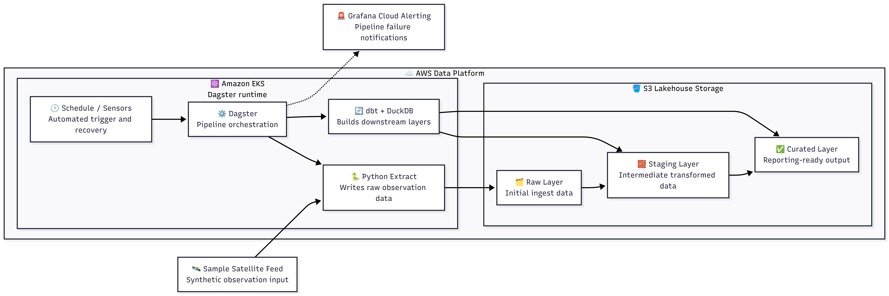

# Sight PoC Data


Data application repository for the Sight PoC platform. This repo contains the application-side runtime, orchestration code, and validation workflow used to run the sample data pipeline.

It currently uses Dagster as the orchestration layer, with dbt and DuckDB handling transformation and local analytical processing. The broader backlog still includes migrating this orchestration layer to Airflow, but the current baseline focuses first on a cleaner MVP foundation with consistent tooling, testability, and delivery hygiene.

This repo owns the application package, tests, image build, and CI flow. The paired infrastructure repo is [sight-poc-infra](https://github.com/BranfordTGbieor/sight-poc-infra), which owns Terraform, Helm, Argo CD, GitOps state, and environment delivery.

## Stack

| Layer | Choice |
| --- | --- |
| Orchestration | Dagster |
| Transformations | dbt |
| Analytical runtime | DuckDB |
| Packaging | Python + `uv` |
| Image build | Docker |
| CI | GitHub Actions |

## Architecture



Source: [utils/mermaid/data-pipeline.mmd](./utils/mermaid/data-pipeline.mmd)

The current sample project is a small lakehouse-style pipeline:

1. Python extraction writes raw satellite observation records
2. dbt transforms clean and enrich those records into `staging`
3. dbt produces curated tile-level summaries in `curated`
4. a daily Dagster schedule targets the current UTC partition
5. a recovery sensor requests the same partition when the expected curated layer is still missing

Storage behavior stays consistent across local and cloud-backed execution:

- local development uses `SIGHT_POC_DATA_LAKE_ROOT`
- cluster execution uses `SIGHT_POC_DATA_LAKE_BUCKET`
- both modes preserve the same raw, staging, and curated layer layout

The intended layer structure is:

- `raw/satellite_observations/ingest_date=YYYY-MM-DD/...`
- `staging/satellite_observations/ingest_date=YYYY-MM-DD/...`
- `curated/tile_summary/partition_date=YYYY-MM-DD/...`

Operationally, Dagster writes the raw layer, invokes the bundled dbt project with `dbt-duckdb`, and exports staged and curated outputs back into the same lake layout. The deployed alerting path for this PoC is still handled from `sight-poc-infra`, even though the codebase also includes an optional Alertmanager-compatible failure sensor.

## Quick Start

Prerequisites:

| Tool | Version | Install docs |
| --- | --- | --- |
| Python | 3.12 | [Reference doc to install Python](https://www.python.org/downloads/) |
| uv | current stable | [Reference doc to install uv](https://docs.astral.sh/uv/getting-started/installation/) |
| Docker | current stable | [Reference doc to install Docker](https://docs.docker.com/engine/install/) |

Bootstrap the local environment:

```bash
uv sync --all-extras
```

Run the standard checks:

```bash
uv run ruff format --check .
uv run ruff check .
uv run pytest
```

## Running the Sample Job

Minimal local run config:

```yaml
ops:
  extract_satellite_observations:
    config:
      batch_date: "2026-04-07"
      should_fail: false
```

Set `should_fail: true` to simulate a controlled job failure for observability and alert-validation work.

## Container Build

```bash
docker build -t sight-poc-dagster:local .
```

## Image Publishing

Image publishing is handled in the application CI workflow.

Publish flow:

1. pushes from `main` publish `latest`
2. version tags like `v0.1.0` publish immutable release tags
3. release-tag pushes notify `sight-poc-infra` to promote that exact image into GitOps values
4. pull requests and non-release branches may still build for validation but do not publish

## AI Assistance Disclosure

This repository was authored and manually reviewed by Branford T. Gbieor with AI assistance used for drafting, refactoring, and documentation support. Final implementation choices, validation steps, and committed changes were reviewed by the author.
