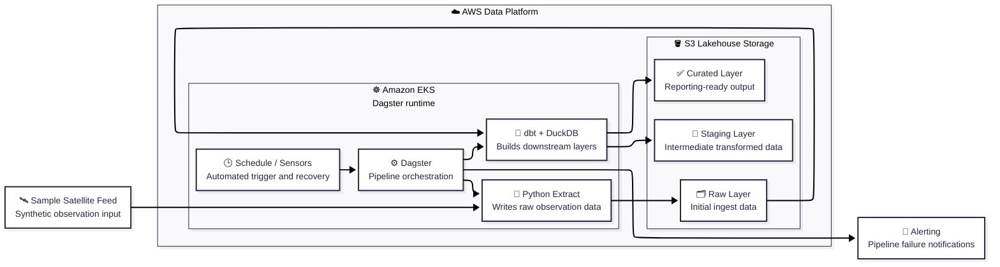

# Hydrosat Data


Dagster application repository for the Hydrosat platform.

This repo owns:

- Dagster jobs, ops, and sensors
- Dagster schedules and recovery sensors
- unit tests
- the Docker image build
- application CI

The infrastructure, Helm chart, Argo CD applications, and environment promotion flow live in the separate `hydrosat-infra` repository.

## Layout

| Path | Purpose |
| --- | --- |
| `hydrosat_dagster/` | Dagster package |
| `tests/` | Application tests |
| `Dockerfile` | Runtime image build |
| `pyproject.toml` | Python package metadata |
| `.github/workflows/ci.yml` | Application CI workflow |

## Sample Pipeline

The current sample project is a small lakehouse-style pipeline orchestrated by Dagster:

1. Python extraction writes raw satellite observation records
2. dbt transforms clean and enrich those records into `staging`
3. dbt produces curated tile-level analytical summaries in `curated`
4. a daily Dagster schedule targets the current UTC partition
5. a recovery sensor requests the same partition if the curated layer is still missing

The filesystem layout mirrors the intended S3 layout we will keep using later:

- `raw/satellite_observations/ingest_date=YYYY-MM-DD/...`
- `staging/satellite_observations/ingest_date=YYYY-MM-DD/...`
- `curated/tile_summary/partition_date=YYYY-MM-DD/...`

For local validation, those layers are written under `HYDROSAT_DATA_LAKE_ROOT`, which defaults to `/tmp/hydrosat-data-lake`.
When `HYDROSAT_DATA_LAKE_BUCKET` is set, the same layer layout is written to S3 by using `HYDROSAT_DATA_LAKE_PREFIX` as the top-level prefix.

## Architecture



Source: [utils/mermaid/data-pipeline.mmd](./utils/mermaid/data-pipeline.mmd)

Storage modes:

- local development uses `HYDROSAT_DATA_LAKE_ROOT`
- cluster execution uses `HYDROSAT_DATA_LAKE_BUCKET`
- both modes preserve the same raw, staging, and curated layer layout

dbt execution model:

- Dagster writes `raw`
- Dagster invokes the bundled dbt project with `dbt-duckdb`
- dbt reads `raw`, materializes transformations in DuckDB, and exports `staging` and `curated` back into the lake layout

Operational behavior:

- `daily_lakehouse_schedule` runs the pipeline at `03:00 UTC`
- `lakehouse_partition_recovery_sensor` checks whether `curated/tile_summary/partition_date=<today>/` already exists
- the recovery sensor only requests a run when the expected curated partition is absent
- the code location still includes an optional Alertmanager-compatible failure sensor, but the default deployed alerting path for this exercise is Grafana Cloud alerting managed from `hydrosat-infra`

## Local Development

```bash
python3 -m venv .venv
source .venv/bin/activate
python -m pip install --upgrade pip
python -m pip install -e ".[dev]"
python -m pytest
```

## Running the Sample Job

Minimal local run config:

```yaml
ops:
  extract_satellite_observations:
    config:
      batch_date: "2026-04-07"
      should_fail: false
```

Use `should_fail: true` to simulate a controlled Dagster job failure for observability and alert-validation work.

## Container Build

```bash
docker build -t hydrosat-dagster:local .
```

## Image Publishing

Image publishing is handled directly in the application CI workflow. Configure:

- `DOCKERHUB_USERNAME`
- `DOCKERHUB_TOKEN`
- `DOCKERHUB_REPOSITORY`
- `HYDROSAT_INFRA_REPO_TOKEN`

Publish flow:

1. pushes from `main` publish `latest`
2. pushes of tags like `v0.1.0` publish immutable version tags
3. release-tag pushes notify `hydrosat-infra` to promote that exact tag into GitOps values
4. pull requests and non-release branches still build the image but do not push it
